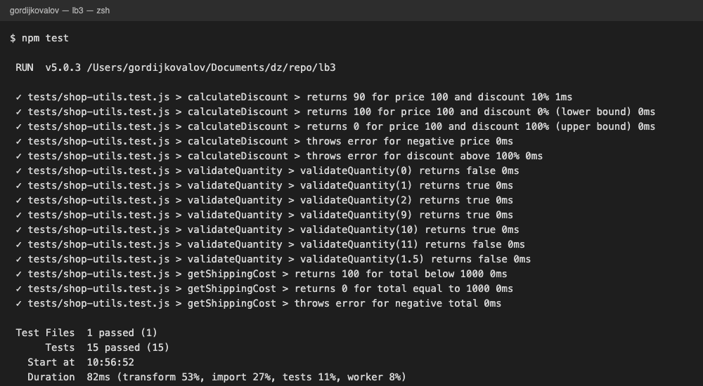
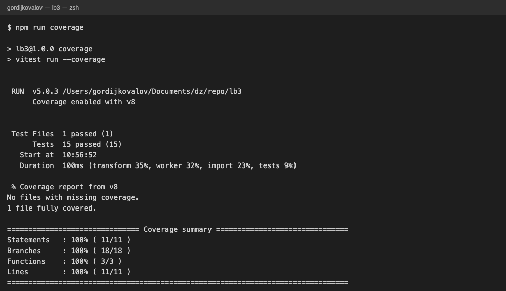
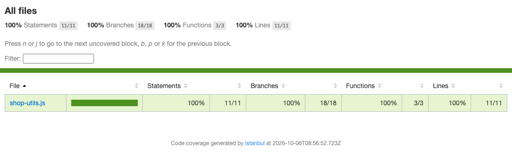
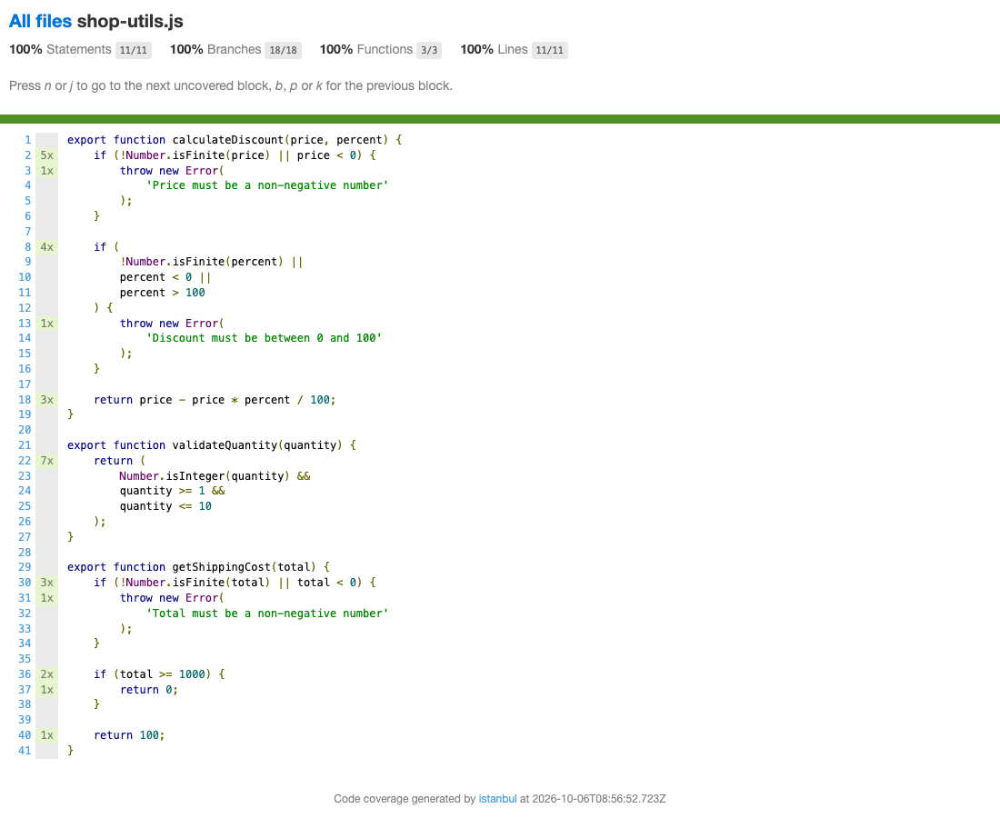
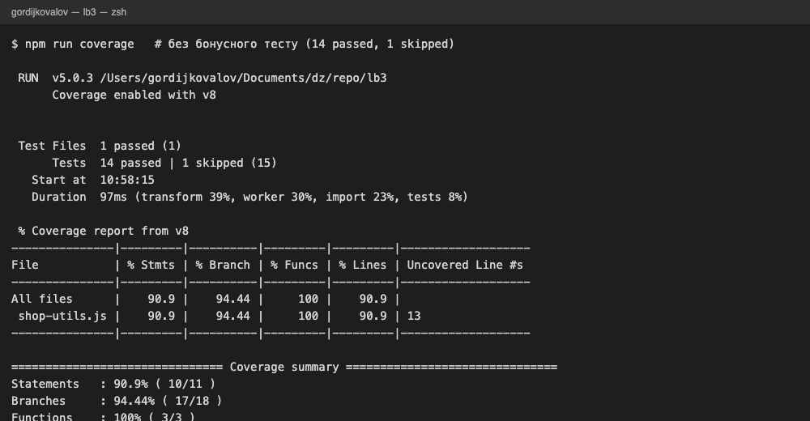
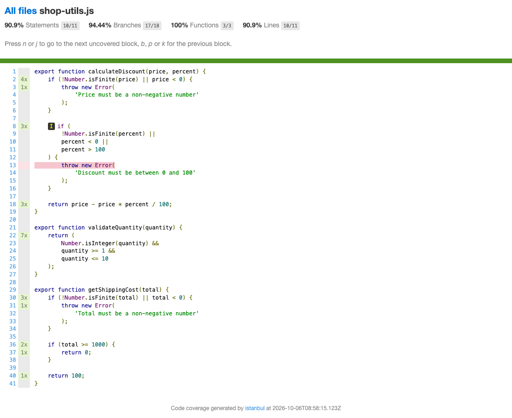

# Лабораторна робота №3

## Модульне тестування програмного коду за допомогою Vitest

**Виконав: Ковальов Гордій**  
**Група: 6.1213.1**  
**Дата: 06.10.2026**

## Test Object

`src/shop-utils.js`

## Функції

- `calculateDiscount()`
- `validateQuantity()`
- `getShippingCost()`

## Test Design

### calculateDiscount

Test Conditions та Test Data:

| Test Condition | price | percent | Expected |
|---|---:|---:|---|
| Типове значення знижки | 100 | 10 | 90 |
| Нижня межа знижки | 100 | 0 | 100 |
| Верхня межа знижки | 100 | 100 | 0 |
| Від'ємна ціна (invalid) | -10 | 10 | `Error: Price must be a non-negative number` |
| Знижка більша за 100 (invalid, додаткове завдання) | 100 | 101 | `Error: Discount must be between 0 and 100` |

### validateQuantity

Equivalence partitions:

| Значення | Partition | Expected |
|---|---|---|
| < 1 | Invalid | `false` |
| 1-10, ціле | Valid | `true` |
| > 10 | Invalid | `false` |
| не ціле число | Invalid | `false` |

Boundary values (межі 1 і 10, параметризований `test.for()`):

| quantity | Expected | Що перевіряє |
|---:|---|---|
| 0 | `false` | значення безпосередньо під нижньою межею |
| 1 | `true` | нижня межа |
| 2 | `true` | значення безпосередньо над нижньою межею |
| 9 | `true` | значення безпосередньо під верхньою межею |
| 10 | `true` | верхня межа |
| 11 | `false` | значення безпосередньо над верхньою межею |
| 1.5 | `false` | не ціле число |

### getShippingCost

Перевірені гілки:

| total | Expected | Гілка |
|---:|---|---|
| 999 | 100 | `0 <= total < 1000` (значення перед межею 1000) |
| 1000 | 0 | `total >= 1000` (сама межа) |
| -1 | `Error: Total must be a non-negative number` | `total < 0` (invalid partition) |

## Результати тестування

| Група тестів | Кількість | Result |
|---|---:|---|
| calculateDiscount | 5 | Pass |
| validateQuantity | 7 | Pass |
| getShippingCost | 3 | Pass |
| **Разом** | **15** | **15 Pass / 0 Fail** |

Усі 15 тестів завершилися Pass: Actual Result збігається з Expected Result. Код у `src/shop-utils.js` не змінювався, тому Fail немає.

## Coverage

| Metric | Result |
|---|---:|
| Statements | 100% (11/11) |
| Branches | 100% (18/18) |
| Functions | 100% (3/3) |
| Lines | 100% (11/11) |

HTML-звіт (`coverage/index.html`):

До додаткового завдання (14 тестів, без тесту `throws error for discount above 100%`) покриття було Statements 90.9% (10/11), Branches 94.44% (17/18), Functions 100% (3/3), Lines 90.9% (10/11); непокритим був рядок 13 — гілка `throw new Error('Discount must be between 0 and 100')`:

Додатковий тест із `percent = 101` виконує цю гілку, після чого всі показники дорівнюють 100%. 100% Coverage означає лише те, що код виконувався під час тестів, і не доводить правильність Test Data, Expected Result чи повноту врахування вимог.

## Висновок

Створено 15 unit tests для трьох функцій `src/shop-utils.js` за схемою Arrange–Act–Assert із групуванням через `describe()`. Для `calculateDiscount()` перевірено типове значення, обидві межі знижки та помилкові `price`/`percent`; для `validateQuantity()` застосовано Equivalence Partitioning, Boundary Value Analysis і параметризований `test.for()`; для `getShippingCost()` перевірено 999, 1000 та -1. Усі тести Pass, Coverage — 100% за всіма метриками.

## Контрольні питання

1. **Що таке Unit Testing?**  
   Це модульне тестування: перевірка найменших частин коду (функцій, методів) окремо від решти системи. Кожен unit test викликає функцію з певними даними і порівнює результат з очікуваним.

3. **Для чого використовується `test()` у Vitest?**  
   `test()` оголошує один окремий тестовий сценарій: приймає назву сценарію і функцію з кодом перевірки. Vitest автоматично виконує її та показує Pass або Fail.

4. **Для чого використовується `expect()`?**  
   `expect(value)` приймає фактичне значення і разом із matcher (`toBe()`, `toThrow()` тощо) утворює перевірку, що порівнює Actual Result з Expected Result.

5. **Що таке assertion?**  
   Assertion - це перевірка умови всередині тесту, наприклад `expect(result).toBe(90)`. Якщо умова хибна, тест завершується Fail.

6. **Що означає схема AAA (Arrange–Act–Assert)?**  
   Це структура тесту з трьох етапів: Arrange - підготовка даних, Act - виклик функції, Assert - перевірка результату. Вона робить тести зрозумілими й однотипними.

7. **Що відбувається на етапі Arrange?**  
   Готуються Test Data та все необхідне для виконання тесту, наприклад `const price = 100; const percent = 10;`.

8. **Що відбувається на етапі Act?**  
   Викликається функція, що тестується, і її результат зберігається як Actual Result: `const result = calculateDiscount(price, percent);`.

9. **Що відбувається на етапі Assert?**  
   Actual Result порівнюється з Expected Result за допомогою assertion, наприклад `expect(result).toBe(90);`.

10. **Для чого використовується `describe()`?**  
    `describe()` об'єднує пов'язані тести в один іменований набір, наприклад `describe('calculateDiscount', ...)`. Це структурує тести та виводить їх згрупованими у звіті.

11. **Для чого використовується `toThrow()`?**  
    `toThrow()` перевіряє, що функція згенерувала помилку (за потреби - із заданим повідомленням), наприклад `toThrow('Price must be a non-negative number')`.

12. **Чому виклик функції при використанні `toThrow()` передається всередині іншої функції?**  
    Якщо написати `expect(calculateDiscount(-10, 10))`, помилка виникне ще під час обчислення аргументу, до того як `expect()` почне роботу, і тест впаде з винятком. Коли передано `() => calculateDiscount(-10, 10)`, Vitest сам викликає цю функцію всередині `expect()` і перехоплює виняток.

13. **Для чого використовується `test.for()`?**  
    `test.for()` створює параметризовані тести: один шаблон перевірки виконується для кількох наборів даних, і для кожного набору Vitest показує окремий результат. Так не потрібно писати кілька однакових тестів, що відрізняються лише даними (у роботі - 7 наборів для `validateQuantity()`).

17. **Що показує Code Coverage?**  
    Code Coverage показує, яка частина коду виконувалася під час тестів: Statements (інструкції), Branches (гілки умов), Functions (функції) і Lines (рядки). Також він вказує, які рядки та гілки залишилися непокритими.

19. **Чому 100% Coverage не гарантує відсутність дефектів?**  
    Coverage показує лише те, що код виконувався, але не доводить, що Test Data правильні, що Expected Result правильний і що враховано всі вимоги. Тест може виконати рядок коду без належної перевірки результату або пропустити важливі вхідні значення (наприклад, `NaN` чи `Infinity`).
